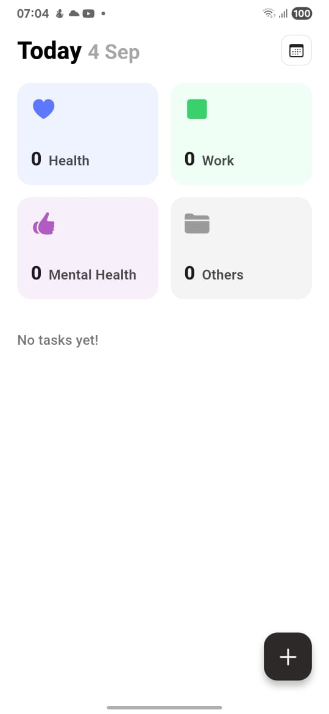
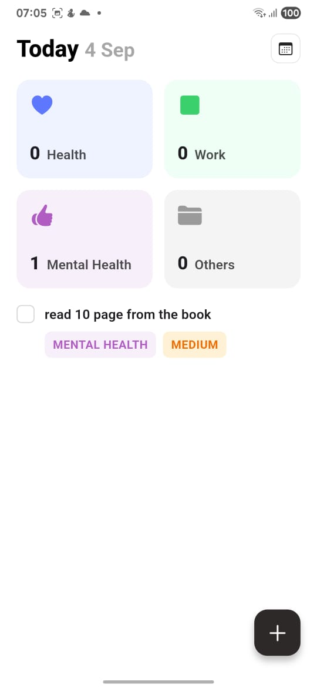
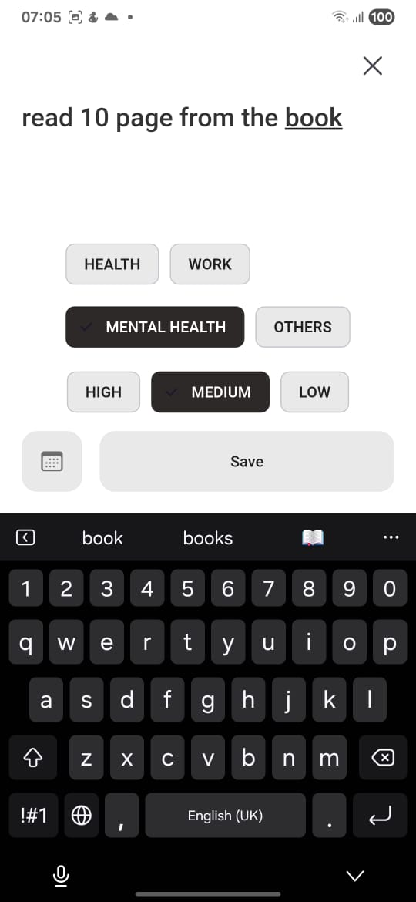
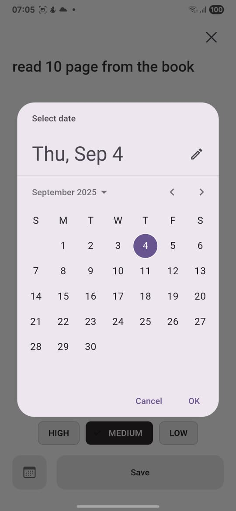
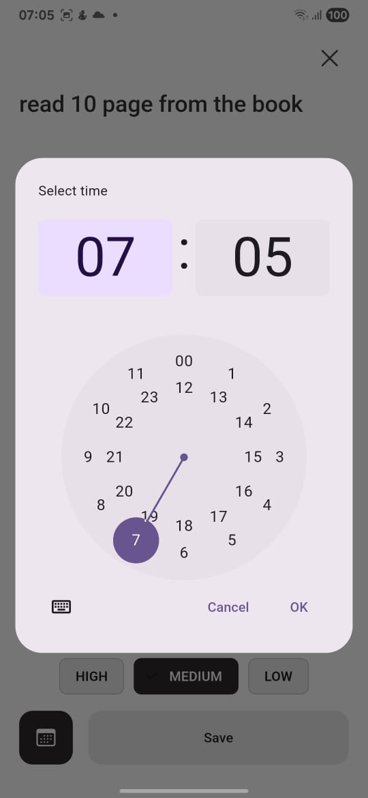
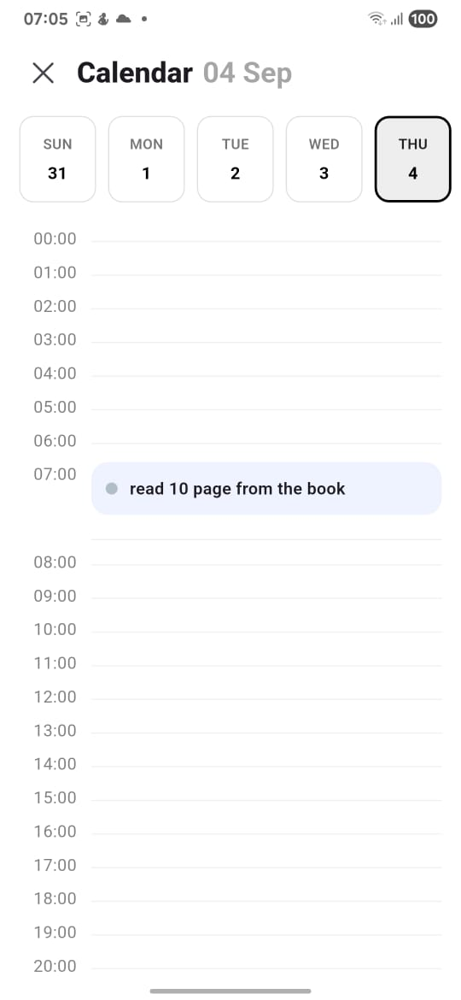
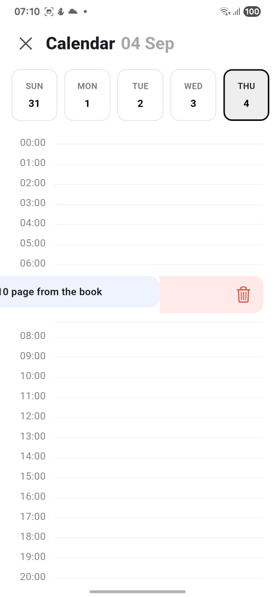
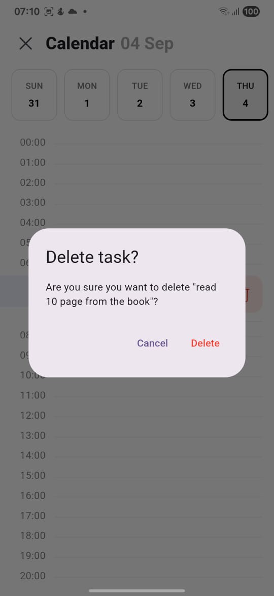

# Todo App

A simple Flutter Todo App for managing daily tasks.

## Table of Content
- [Features](#features)
- [Screenshots](#screenshots)
- [Requirements](#requirements)
- [Setup](#setup)

## Features
- Add, edit, and delete tasks
- Mark tasks as completed
- View tasks in a list

## Screenshots
Home Screen:

Add Task:

Select Date:

Select Time:

Calendar Screen:

Delete Task:

## Requirements
- Flutter 3.x or higher
- Dart SDK
- Android Studio or VS Code
- Emulator or physical device

## Setup
1. Clone this repository.
2. Ensure you have Flutter installed.
3. Run flutter pub get to install dependencies.
4. Run flutter run to launch the app on your device or simullator.